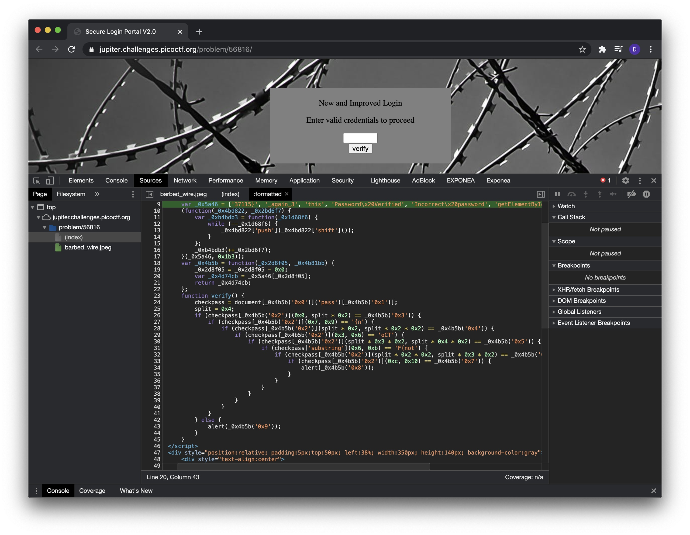
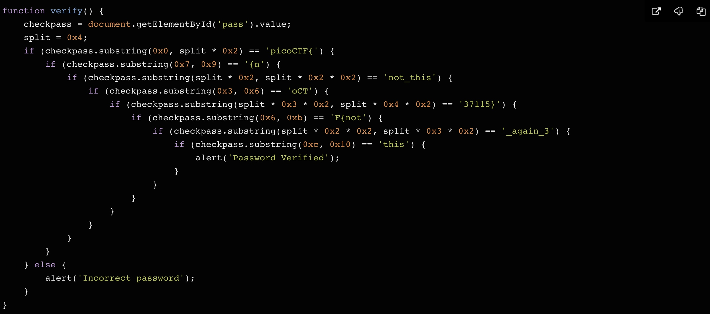

# Problem

> Can you break into this super secure portal? https://jupiter.challenges.picoctf.org/problem/56816/ (link) or http://jupiter.challenges.picoctf.org:56816

## Hints:

> What is obfuscation?

## Solution:

1. Need to check source code of the site. Firstly, beautify minified js.
   

2. Then lets decode obfuscation code:
   

3. Finally connect all parts together and get flag:

### Flag

`picoCTF{not_this_again337115}`
