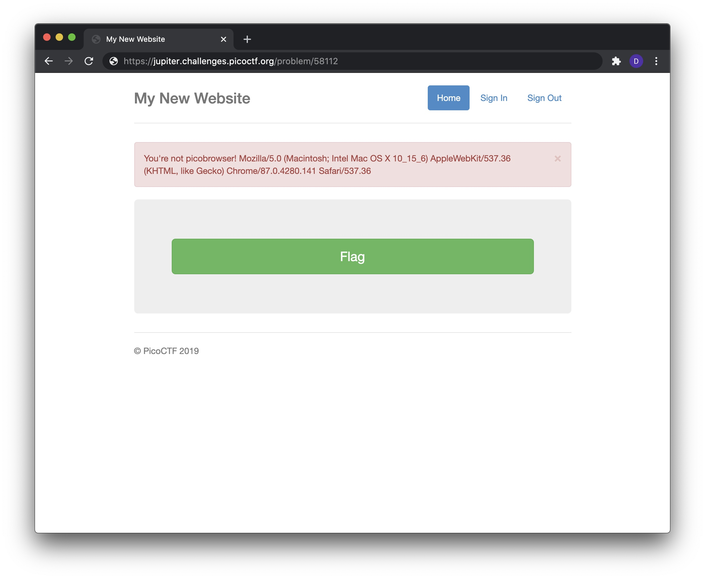

# Problem

> The image link appears broken... https://jupiter.challenges.picoctf.org/problem/58112 or http://jupiter.challenges.picoctf.org:58112

## Hints:

> This is only a JavaScript problem.

## Solution:

1. We cant use button, because we have an error.
   

2. So lets check source code and find the flag:

   ```bash
   <body>

    <div class="container">
        <div class="header">
            <nav>
                <ul class="nav nav-pills pull-right">
                    <li role="presentation" class="active"><a href="/">Home</a>
                    </li>
                    <li role="presentation"><a href="/unimplemented">Sign In</a>
                    </li>
                    <li role="presentation"><a href="/unimplemented">Sign Out</a>
                    </li>
                </ul>
            </nav>
            <h3 class="text-muted">My New Website</h3>
        </div>

       <!-- Categories: success (green), info (blue), warning (yellow), danger (red) -->


       <div class="alert alert-success alert-dismissible" role="alert" id="myAlert">
         <button type="button" class="close" data-dismiss="alert" aria-label="Close"><span aria-hidden="true">&times;</span></button>
         <!-- <strong>Title</strong> --> picobrowser!
           </div>


        <div class="jumbotron">
            <p class="lead"></p>
            <p style="text-align:center; font-size:30px;"><b>Flag</b>: <code>picoCTF{p1c0_s3cr3t_ag3nt_e9b160d0}</code></p>
            <!-- <p><a class="btn btn-lg btn-success" href="admin" role="button">Click here for the flag!</a> -->
            <!-- </p> -->
        </div>


        <footer class="footer">
            <p>&copy; PicoCTF 2019</p>
        </footer>

    </div>
    <script>
    $(document).ready(function(){
        $(".close").click(function(){
            $("myAlert").alert("close");
        });
    });
    </script>
   </body>
   ```

### Flag

`picoCTF{p1c0_s3cr3t_ag3nt_e9b160d0}`

```

```
